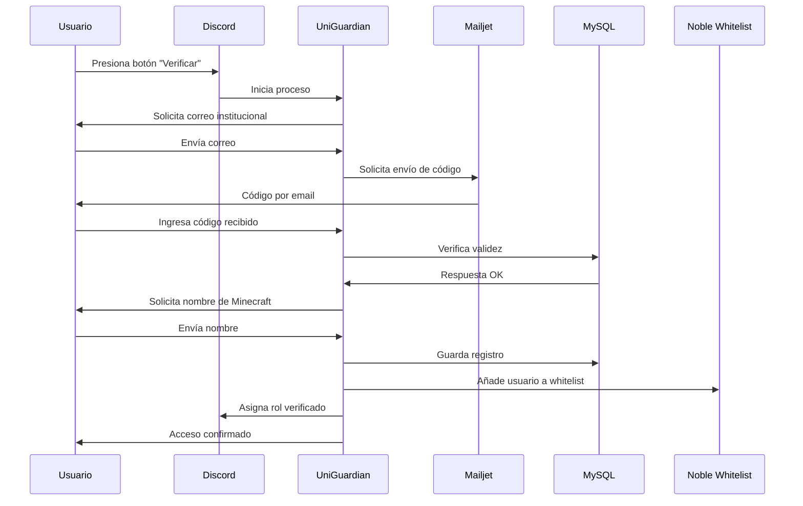

# 🎓 UniGuardian  
**Plataforma de Verificación Académica para Comunidades Digitales**

UniGuardian es un sistema integrado de **verificación de identidad y gestión de comunidades académicas** que conecta **Discord** con **Minecraft**, creando espacios digitales **seguros, exclusivos y fáciles de administrar** para instituciones educativas.  

---

## 🚀 Características Principales

### 🔒 Verificación de Identidad
- Validación automática de **correos institucionales** (`@mail.pucv.cl`).  
- Generación de **códigos únicos con expiración**.  
- Protección frente a intentos de acceso no autorizados.  

### 🤖 Integración con Discord
- Asignación de roles automática (**verificado/no verificado**).  
- Panel administrativo para gestión de usuarios.  
- Flujo de interacción con botones y menús en Discord.  

### 🎮 Conexión con Minecraft
- Registro centralizado de nombres de usuario.  
- **Integración directa con Noble Whitelist**.  
- Sincronización automática de whitelist con base de datos.  
- Gestión unificada de permisos entre plataformas.  

### 📊 Gestión Administrativa
- **Dashboard web** para supervisión de usuarios.  
- Estadísticas de adopción y actividad.  
- Herramientas de **moderación y control**.  

---

## 🏗️ Arquitectura del Sistema

```mermaid
graph TD
    A[Discord Bot] -->|Autenticación| B(API Discord)
    A -->|Almacenamiento| C[MySQL Database]
    A -->|Correo| D[Mailjet API]
    C -->|Sync Whitelist| E[Noble Whitelist (Minecraft)]
    F[Panel Admin] --> C
    G[Usuarios] --> A
```

---

## ⚙️ Requisitos Técnicos

| Componente          | Versión mínima | Uso |
|---------------------|---------------|-----|
| **Python**          | 3.9+          | Lenguaje principal |
| **MySQL**           | 8.0+          | Almacenamiento persistente |
| **Discord Server**  | N/A           | Entorno de despliegue con permisos admin |
| **Mailjet**         | Cuenta activa | Envío de correos de verificación |
| **Noble Whitelist** | Última versión | Gestión de whitelist en Minecraft |

---

## 📦 Instalación y Configuración

```bash
# 1. Clonar el repositorio
git clone https://github.com/tu-institucion/uniguardian.git
cd uniguardian

# 2. Instalar dependencias
pip install -r requirements.txt

# 3. Configurar variables de entorno
cp .env.example .env
# Editar .env con tus credenciales (DB, Discord, Mailjet, Noble Whitelist)

# 4. Iniciar el sistema
python bot.py
```

---

## 🔑 Flujo de Verificación



---

## 🎯 Casos de Uso Institucional

- Comunidades privadas en Discord con acceso verificado.  
- Servidores de Minecraft académicos con **Noble Whitelist** automático.  
- Eventos virtuales interdisciplinarios en entornos digitales.  
- Proyectos colaborativos con acceso controlado.  
- Espacios de **tutoría y asesoría** con membresía validada.  

---

## 💡 Beneficios para Instituciones

- **Seguridad mejorada** → Acceso restringido a usuarios verificados.  
- **Eficiencia** → Procesos automatizados de verificación.  
- **Integración real con Minecraft** gracias a **Noble Whitelist**.  
- **Experiencia unificada** → Discord + Minecraft en un solo flujo.  
- **Escalabilidad** → Arquitectura modular adaptable.  

---

## 🤝 Contribuciones

Este proyecto sigue las guías de contribución open source. Puedes aportar mediante:  

- Reportes de errores (**Issues**).  
- Solicitudes de características (**Feature Requests**).  
- Pull Requests con mejoras documentadas.  

Antes de contribuir, revisa nuestras [directrices de contribución](CONTRIBUTING.md).  

---

## 📜 Licencia

Distribuido bajo licencia **MIT**. Consulta el archivo [LICENSE](LICENSE).  

---

✨ *UniGuardian — Transformando comunidades académicas con espacios digitales seguros e integrados.*  
